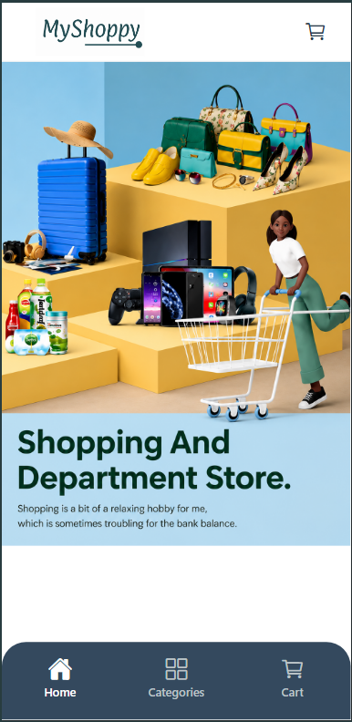
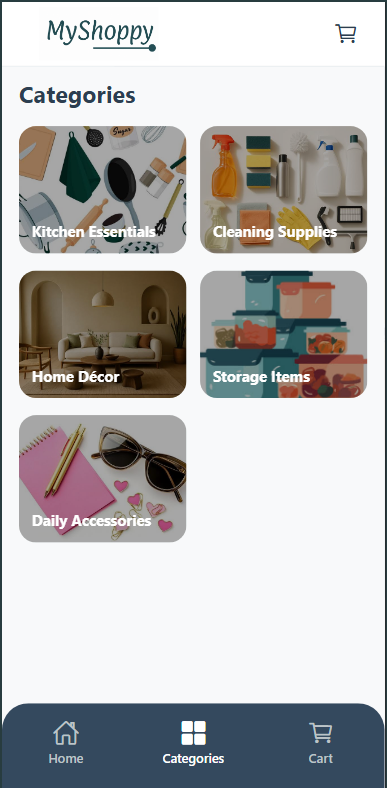
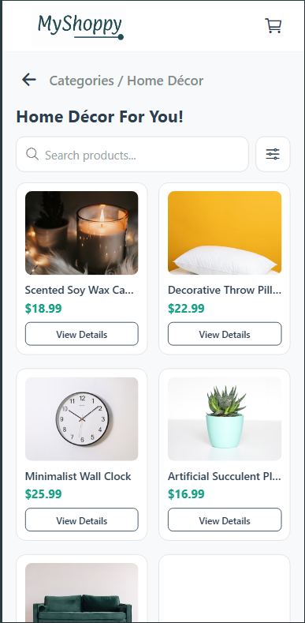
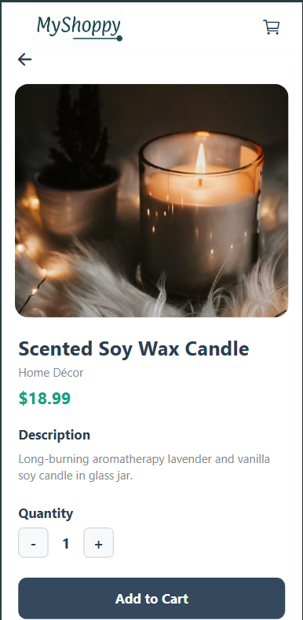
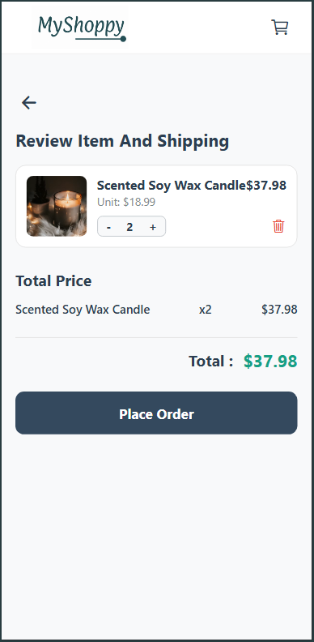
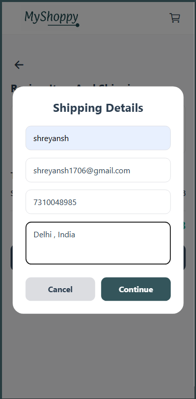
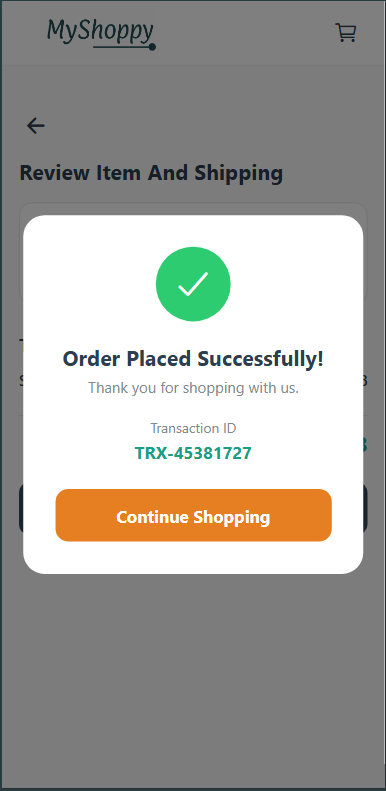

# 🛍️ MyShoppy - Cross-Platform E-Commerce Mobile App

MyShoppy is a modern cross-platform e-commerce application built using **React Native**, **Expo Router**, and **TypeScript**. It supports **Android**, **iOS**, **Web**, and **physical mobile devices**, providing a smooth shopping experience with category browsing, product filtering, cart management, and checkout functionality.

---
# 📸 Application Screenshots

| Home | Categories |
|------|------------|
|  |  |

| Product Listing | Product Details |
|-----------------|-----------------|
|  |  |

| Cart | Shipping Details |
|------|------------------|
|  |  |

| Order Success |
|---------------|
|  |


# 🚀 Setup Guide

Follow the steps below to set up and run the project on your local machine.

## Prerequisites

Make sure you have the following installed:

- Node.js (Latest LTS version recommended)
- npm
- Expo CLI or Expo Go App
- Git

---

## 1. Clone the Repository

```bash
git clone https://github.com/ShreyanshMishra1706/MySoppy_ExpoApp

cd MyShoppy
```

---

## 2. Install Dependencies

Install all required packages.

```bash
npm install
```

This installs all dependencies including:

- React Native
- Expo
- Expo Router
- Axios
- React Navigation
- Vector Icons
- TypeScript
- AsyncStorage

---

## 3. Configure the API Base URL

Open the following file:

```
services/api.ts
```

Update the base URL according to your testing environment.

Example:

```ts
// Physical Device
http://172.28.99.3:3000

// Android Emulator
http://10.0.2.2:3000

// iOS Simulator
http://localhost:3000

// Web
http://localhost:3000
```

Replace the IP address with your computer's local IPv4 address when testing on a physical device.

---

## 4. Start the Backend Server

Run the local backend server.

```bash
npm run server
```

Ensure the server starts successfully on:

```
http://localhost:3000
```

The backend should expose the following endpoint:

```
GET /products
```

---

## 5. Start the Expo Development Server

Open another terminal and run:

```bash
npx expo start
```

---

## 6. Launch the Application

You can run the application on:

### Web

Press:

```text
w
```

---

### Android

Press:

```text
a
```

---

### iOS

Press:

```text
i
```

(macOS only)

---

### Physical Device

1. Install **Expo Go**.
2. Scan the QR code.
3. Ensure your mobile device and computer are connected to the same network.

---

# 📱 Application Flow

## 1. Home / Categories Screen

The application starts on the **Categories Screen**, where users can browse available product categories displayed in a responsive grid layout.

Users simply tap a category to continue shopping.

---

## 2. Category Products Screen

After selecting a category, users are navigated to the product listing page.

Features include:

- Category-based product filtering
- Search products by name
- Maximum price filters
- In-stock only toggle
- Responsive product cards

Products are fetched dynamically from the backend API.

---

## 3. Product Details Screen

Selecting a product opens the detailed product page.

The following information is displayed:

- Product Image
- Product Name
- Price
- Description
- Category
- Stock Availability

Users can:

- Increase quantity
- Decrease quantity
- Add products to the shopping cart

A success banner confirms when an item is added.

---

## 4. Cart Screen

The cart allows users to:

- View selected products
- Increase quantities
- Decrease quantities
- Remove products
- View subtotal
- View total amount
- Continue to checkout

The cart state is managed globally using React Context.

---

## 5. Checkout & Shipping

Selecting **Checkout** opens the shipping modal.

Users enter shipping details.

After successful confirmation:

- Order is completed
- Cart is cleared
- User is redirected back to the Home Screen

---

# ✨ Features

## 🛒 Dynamic Category Browsing

Browse products grouped into organized shopping categories using a responsive card-based interface.

---

## 🔍 Advanced Product Search

Search products instantly using a real-time search bar.

---

## 🎯 Smart Filters

Filter products using:

- Maximum Price
- Stock Availability
- Category Selection

---

## 🛍️ Global Cart Management

Implemented using **React Context API**.

Supports:

- Add to Cart
- Remove from Cart
- Update Quantity
- Calculate Total Price
- Clear Cart

The cart state is accessible throughout the application.

---

## 🖼️ Stable Product Images

Permanent image URLs are mapped to products, ensuring images remain consistent after refreshing the application.

---

## 🌐 Cross-Platform Support

The application works seamlessly on:

- Web
- Android
- iOS
- Physical Devices

Platform-specific API configurations ensure smooth connectivity.

---

## 🚚 Shipping Modal

Integrated checkout flow with:

- Shipping Information Form
- Order Confirmation
- Success Message
- Automatic Navigation to Home


---

# 📋 Assumptions

The following assumptions were made while developing the project.

### Backend Availability

A local backend server (JSON Server ) is running on:

```
http://localhost:3000
```

The backend exposes:

```
GET /products
```

---

### Network Configuration

When using Expo Go on a physical device:

- The computer and mobile phone must be connected to the same network.
- The API URL should use the computer's local IPv4 address.

---

### Expo Router

The application assumes Expo Router correctly handles parameter passing using `router.push()` for:

- Product ID
- Product Name
- Description
- Price
- Category
- Product Image

---

### Stable Image URLs

All products use permanent image URLs to prevent images from changing after page refreshes.

---

# 🛠️ Tech Stack

| Technology | Purpose |
|------------|---------|
| React Native | Cross-platform mobile development |
| Expo | Development environment |
| Expo Router | Navigation |
| TypeScript | Type safety |
| Axios | API requests |
| React Context API | Global state management |
| JSON Server | Mock backend |
| React Native Vector Icons | Icons |
| FlatList | Efficient product rendering |

---

# 📸 Screens Included

- 🏠 Home Screen
- 📂 Categories Screen
- 🛍️ Product Listing
- 📄 Product Details
- 🛒 Shopping Cart
- 🚚 Shipping Modal
- ✅ Order Success

---

# 👨‍💻 Author

**Shreyansh Mishra**

Built as a cross-platform React Native e-commerce application demonstrating:

- Expo Router Navigation
- API Integration
- Context API State Management
- Product Filtering
- Shopping Cart
- Checkout Workflow
- Responsive UI
- Cross-platform Compatibility

---

